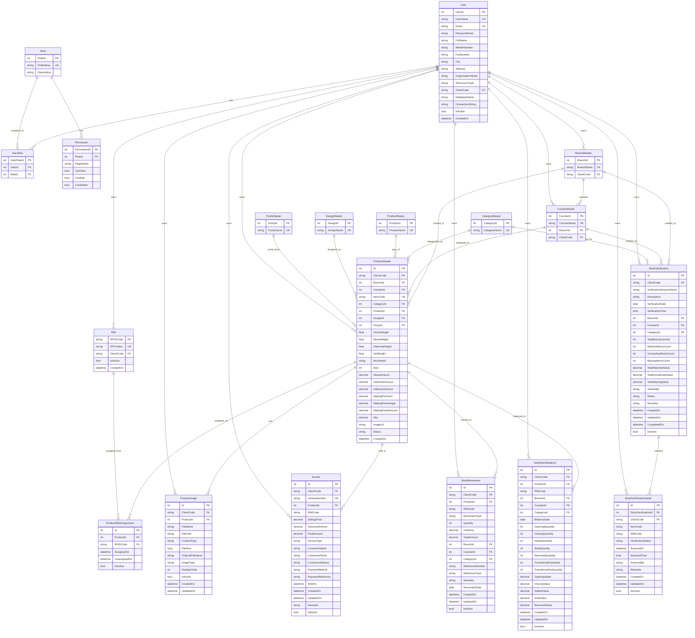

# 🏗️ RFID Jewelry Inventory System - Entity Relationship Diagram

## 📊 Complete Database Schema Overview

This document contains the complete Entity Relationship (ER) diagram for the RFID Jewelry Inventory Management System. The system is designed with a multi-tenant architecture where each client has their own isolated database.

---

## 🔗 Mermaid ER Diagram

---

## 📋 Table Descriptions

### 🔐 **User Management & Authentication**
- **`User`**: Main user table with multi-tenant support
- **`Role`**: User roles for access control
- **`UserRole`**: Many-to-many relationship between users and roles
- **`Permission`**: Granular permissions for each role

### 🏢 **Master Data Tables**
- **`CategoryMaster`**: Product categories (e.g., Gold, Silver, Diamond)
- **`ProductMaster`**: Product types (e.g., Ring, Necklace, Earring)
- **`DesignMaster`**: Design patterns and styles
- **`PurityMaster`**: Purity levels (e.g., 24K, 22K, 18K)
- **`BranchMaster`**: Store branches with client isolation
- **`CounterMaster`**: Display counters within branches

### 💎 **Core Product & RFID Tables**
- **`ProductDetails`**: Main product information with all specifications
- **`Rfid`**: RFID tag information with EPC values
- **`ProductRfidAssignment`**: Links products to RFID tags
- **`ProductImage`**: Product images with metadata

### 📊 **Stock Verification System**
- **`StockVerification`**: Stock verification sessions
- **`StockVerificationDetail`**: Individual items in verification sessions

### 🧾 **Invoice & Sales Management**
- **`Invoice`**: Sales invoices with customer details

### 📈 **Stock Tracking & Movement**
- **`StockMovement`**: All stock movements (additions, sales, transfers)
- **`DailyStockBalance`**: Daily opening/closing stock balances

---

## 🔑 Key Features

### 🏗️ **Multi-Tenant Architecture**
- Each client has isolated data through `ClientCode`
- Separate database per client for complete isolation

### 🏷️ **RFID Integration**
- EPC value tracking for each RFID tag
- Product-RFID assignment management
- RFID scanning and verification support

### 📊 **Comprehensive Stock Management**
- Real-time stock tracking
- Movement history
- Daily balance calculations
- Stock verification workflows

### 🔐 **Role-Based Access Control**
- Granular permissions system
- User role management
- Secure authentication

### 📸 **Media Management**
- Product image storage
- Multiple image types support
- Organized display ordering

---

## 🎯 **Business Logic Flow**

1. **Product Creation**: Products are created with master data references
2. **RFID Assignment**: RFID tags are assigned to products
3. **Stock Tracking**: All movements are tracked in real-time
4. **Sales Processing**: Invoices are generated for sales
5. **Stock Verification**: Regular verification sessions ensure accuracy
6. **Reporting**: Comprehensive reports from all data points

---

## 📝 **Notes**

- All tables include `IsActive` flag for soft deletion
- Timestamps (`CreatedOn`, `UpdatedOn`) for audit trails
- Foreign key relationships ensure data integrity
- Multi-tenant design allows complete client isolation
- RFID system supports both EPC and custom RFID codes
- Stock verification provides comprehensive inventory accuracy

---

*This ER diagram represents the complete database schema for the RFID Jewelry Inventory Management System.*
