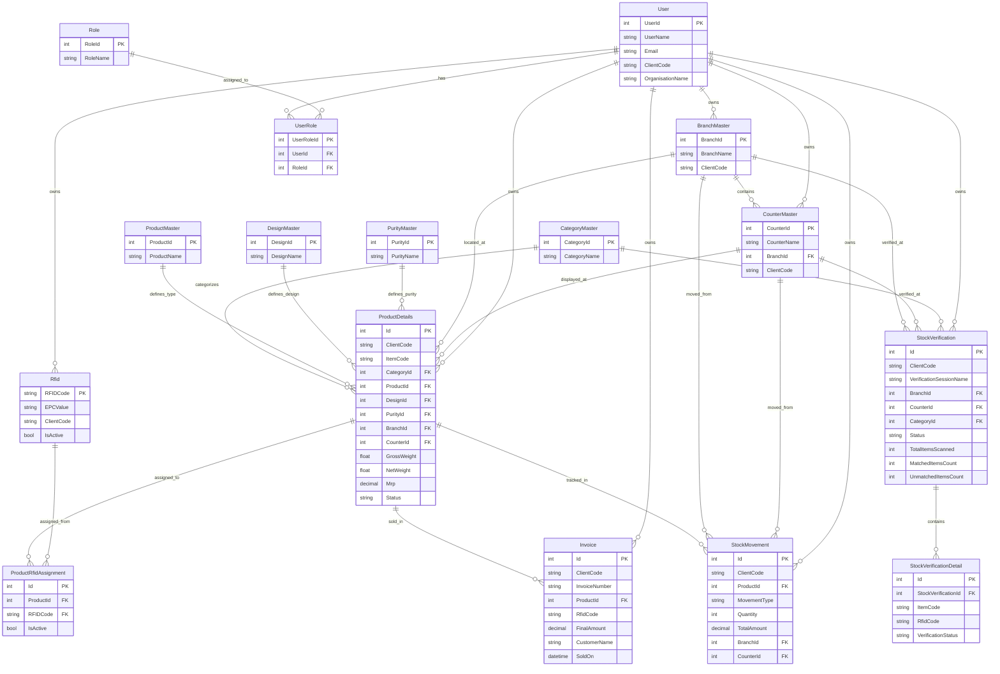

# 🏗️ RFID Jewelry Inventory System - Simplified ER Diagram

## 📊 Simplified Database Schema

This is a simplified version of the Entity Relationship diagram focusing on the core business entities and their relationships.

---

## 🔗 Simplified Mermaid ER Diagram



---

## 🎯 **Core Business Flow**

### 1. **Product Management**
```
CategoryMaster → ProductDetails ← ProductMaster
     ↓                    ↓              ↓
DesignMaster         BranchMaster   PurityMaster
     ↓                    ↓              ↓
CounterMaster ← BranchMaster
```

### 2. **RFID Assignment**
```
Rfid → ProductRfidAssignment ← ProductDetails
```

### 3. **Stock Verification**
```
StockVerification → StockVerificationDetail
       ↓                    ↓
BranchMaster/CounterMaster/CategoryMaster
```

### 4. **Sales & Movement**
```
ProductDetails → Invoice
       ↓           ↓
StockMovement ← BranchMaster/CounterMaster
```

---

## 🔑 **Key Design Principles**

1. **Multi-Tenant**: All business tables include `ClientCode` for isolation
2. **Master Data**: Lookup tables for consistent categorization
3. **RFID Integration**: Complete RFID lifecycle management
4. **Stock Tracking**: Comprehensive movement and balance tracking
5. **Verification**: Built-in stock verification workflows
6. **Audit Trail**: Timestamps and status tracking throughout

---

## 📝 **Simplified View Benefits**

- **Easier to understand** the core business relationships
- **Focus on main entities** without overwhelming detail
- **Clear data flow** from master data to business operations
- **Quick overview** for stakeholders and developers
- **Foundation for understanding** the complete system

---

*This simplified diagram shows the essential structure while the full diagram provides complete technical details.*
